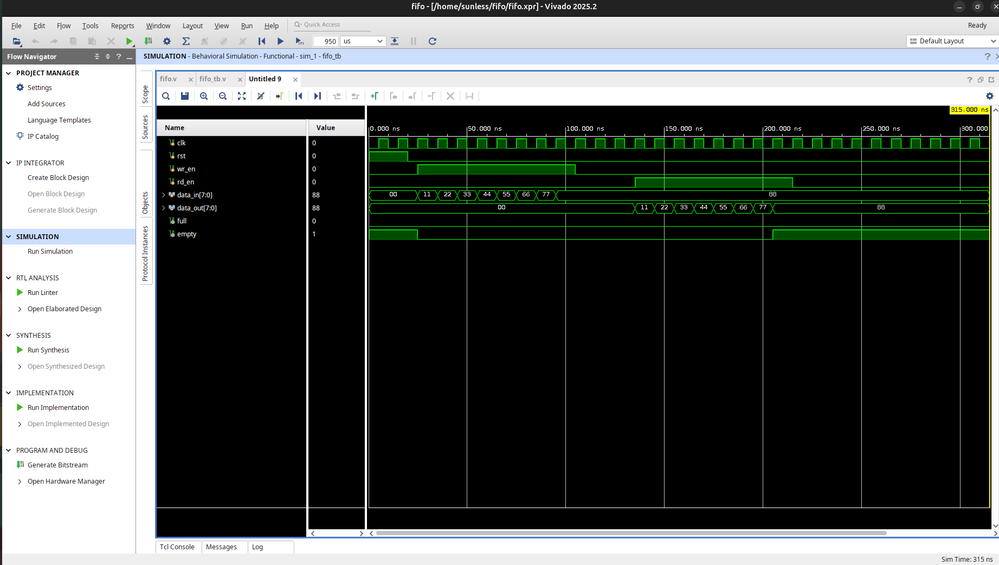

# FIFO Memory using Verilog HDL

Synchronous FIFO (First In First Out) memory implemented and verified using Verilog HDL in Vivado.

## Overview

This project implements a simple synchronous FIFO buffer that stores data in the order it is received and outputs data in the same order. The design uses separate read and write pointers along with full and empty status flags for flow control.

## Features

- Synchronous FIFO architecture
- Separate read and write operations
- Full flag generation
- Empty flag generation
- Parameterized memory depth
- Behavioral simulation and verification in Vivado

## Design Details

| Parameter | Value |
|------------|---------|
| Data Width | 8-bit (default) |
| FIFO Depth | 16 Entries (default) |
| Address Width | 4-bit |
| Clock Type | Single Clock |

### Inputs

- `clk` : System clock
- `rst` : Reset signal
- `wr_en` : Write enable
- `rd_en` : Read enable
- `data_in[7:0]` : Input data

### Outputs

- `data_out[7:0]` : Output data
- `full` : FIFO full indicator
- `empty` : FIFO empty indicator

## Verification

The FIFO was verified using a dedicated Verilog testbench.

Test cases performed:

- Reset operation
- Sequential data write
- Sequential data read
- Data integrity verification
- Empty flag verification

Simulation confirms correct FIFO behavior and data ordering.

## Simulation Result

### FIFO Waveform



## Project Structure

```text
fifo-verilog/
├── rtl/
│   └── fifo.v
├── tb/
│   └── fifo_tb.v
├── screenshots/
│   └── fifo_waveform.png
└── README.md
